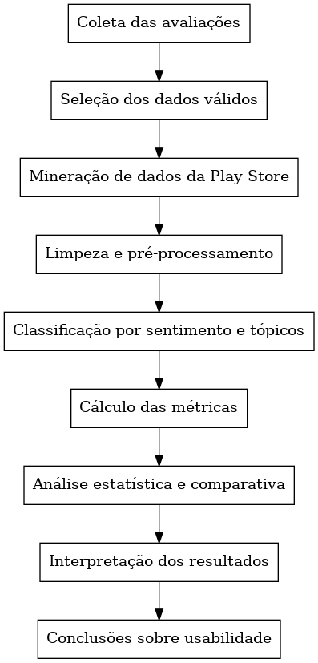

# 1. Identificação Básica

Este projeto tem como objetivo analisar a usabilidade de aplicativos de transporte público utilizados nas cidades de **São Paulo**, **Belo Horizonte** e **Rio de Janeiro**. A investigação utiliza avaliações de usuários publicadas na **Google Play Store**, que serão extraídas, organizadas e analisadas por meio de técnicas de **mineração de comentários**, **processamento de linguagem natural** e **análise de sentimentos**.

---

# 2. Contexto e Problema de Pesquisa

Aplicativos de transporte público são amplamente utilizados pelos cidadãos para planejar rotas, consultar horários e acompanhar deslocamentos em tempo real. A qualidade da experiência oferecida por esses aplicativos influencia diretamente a mobilidade urbana, a satisfação dos usuários e a eficiência percebida do serviço.

Apesar de sua relevância, esses aplicativos frequentemente recebem críticas relacionadas à **usabilidade**, como informações imprecisas, falhas de navegação, lentidão, instabilidade e ausência de atualizações. As avaliações disponíveis na Google Play Store representam uma fonte rica de dados empíricos, pois refletem experiências reais de uso em contextos urbanos distintos.

Entretanto, esse conteúdo ainda é pouco explorado de forma **sistemática e comparativa**, especialmente considerando diferentes capitais brasileiras. Assim, este estudo busca responder à seguinte questão de pesquisa:

> **Quais diferenças e semelhanças podem ser identificadas na usabilidade percebida pelos usuários dos principais aplicativos de transporte público de São Paulo, Belo Horizonte e Rio de Janeiro, a partir das avaliações disponíveis na Google Play Store?**

---

# 3. Título do Estudo

**Avaliação Comparativa de Usabilidade de Aplicativos de Transporte Público nas cidades de Belo Horizonte, Rio de Janeiro e São Paulo**

---

# 4. Escopo do Estudo

Analisar os aplicativos de transporte público **Moovit**, **Cittamobi** e **BHBus** com o propósito de **comparar a usabilidade percebida pelos usuários**, em relação aos aspectos de qualidade associados à satisfação, aos problemas relatados e aos pontos positivos.

A análise será conduzida a partir da perspectiva dos usuários do transporte público que publicaram avaliações na Google Play Store, no contexto da mobilidade urbana das cidades de Belo Horizonte, Rio de Janeiro e São Paulo.

---

# 5. Definição de Objetivos — GQM

## 5.1 Tabela GQM

| Objetivo                                                               | Perguntas                                                    | Métricas                                                                      |
| ---------------------------------------------------------------------- | ------------------------------------------------------------ | ----------------------------------------------------------------------------- |
| **O1 – Identificar fatores que influenciam satisfação e insatisfação** | P1.1 – Quais sentimentos predominam nas avaliações?          | M1.1 – Percentual de sentimentos; M1.4 – Média das avaliações                 |
| O1                                                                     | P1.2 – Quais problemas são mais mencionados?                 | M1.2 – Frequência de termos negativos; M3.4 – Ocorrências por categoria       |
| O1                                                                     | P1.3 – Quais aspectos positivos são recorrentes?             | M1.3 – Frequência de termos positivos; M3.1 – Frequência absoluta de palavras |
| **O2 – Comparar a percepção entre aplicativos**                        | P2.1 – Qual aplicativo possui maior avaliação média?         | M2.1 – Nota média; M2.4 – Desvio padrão                                       |
| O2                                                                     | P2.2 – Qual possui maior proporção de sentimentos positivos? | M2.2 – Distribuição de sentimentos; M1.1 – Percentual                         |
| O2                                                                     | P2.3 – Quais tópicos diferem entre aplicativos e capitais?   | M2.3 – Frequência de palavras-chave; M3.2 – Frequência relativa               |
| **O3 – Analisar padrões textuais**                                     | P3.1 – Quais palavras aparecem com maior frequência?         | M3.1 – Frequência absoluta; M3.2 – Frequência relativa                        |
| O3                                                                     | P3.2 – Quais temas variam entre capitais?                    | M3.4 – Ocorrências por categoria                                              |
| **O4 – Propor recomendações de melhoria**                              | P4.1 – Quais problemas impactam a avaliação média?           | M4.1 – Correlação nota/sentimento                                             |
| O4                                                                     | P4.2 – Quais problemas são recorrentes ao longo do tempo?    | M4.2 – Reclamações no tempo                                                   |

---

# 6. Métricas do Estudo

| Código | Descrição                                            | Unidade           |
| ------ | ---------------------------------------------------- | ----------------- |
| M1.1   | Percentual de sentimentos (positivo/negativo/neutro) | %                 |
| M1.2   | Frequência de termos negativos                       | ocorrências       |
| M1.3   | Frequência de termos positivos                       | ocorrências       |
| M1.4   | Média das avaliações                                 | estrelas          |
| M2.1   | Nota média por aplicativo                            | estrelas          |
| M2.2   | Distribuição de sentimentos por aplicativo           | %                 |
| M2.3   | Frequência comparativa de palavras-chave             | ocorrências       |
| M2.4   | Desvio padrão das notas                              | estrelas          |
| M3.1   | Frequência absoluta de palavras                      | ocorrências       |
| M3.2   | Frequência relativa por capital                      | %                 |
| M3.3   | Distribuição temporal das avaliações                 | datas             |
| M3.4   | Ocorrências por categoria temática                   | ocorrências       |
| M4.1   | Correlação entre nota e sentimento                   | coeficiente       |
| M4.2   | Reclamações ao longo do tempo                        | ocorrências/tempo |

---

# 7. Modelo Conceitual

O modelo conceitual relaciona:

* **Aplicativos analisados:** Moovit, Cittamobi e BHBus;
* **Contexto urbano:** São Paulo, Belo Horizonte e Rio de Janeiro;
* **Atributos de usabilidade percebida:** eficiência, eficácia e satisfação (ISO 9241-11);
* **Indicadores empíricos:** notas, volume de avaliações, sentimentos e temas recorrentes.

A experiência relatada pelos usuários é influenciada tanto por fatores internos aos aplicativos (interface, desempenho, estabilidade e clareza das informações) quanto pelo contexto urbano de uso. Esses elementos convergem para uma análise comparativa entre aplicativos e cidades.

---

# 8. Hipóteses de Pesquisa

* **H1:** Em **São Paulo**, o aplicativo utilizado apresenta maior percepção de completude funcional, refletida em maior diversidade de recursos citados nas avaliações, devido à complexidade e ao tamanho do sistema de transporte da cidade.
* **H2:** Em **Belo Horizonte**, avaliações negativas do **BHBus** concentram-se predominantemente em problemas de confiabilidade e atualização de informações em tempo real.
* **H3:** No **Rio de Janeiro**, aplicativos com menor nota média apresentam maior recorrência de reclamações relacionadas à navegação e clareza das rotas.
* **H4:** Avaliações com notas mais baixas estão estatisticamente associadas à menção simultânea de problemas de interface e desempenho, independentemente da cidade.

---

# 9. Variáveis do Estudo

| Variável           | Tipo         | Descrição                                   |
| ------------------ | ------------ | ------------------------------------------- |
| Cidade             | Independente | São Paulo, Belo Horizonte ou Rio de Janeiro |
| Aplicativo         | Independente | Moovit, Cittamobi ou BHBus                  |
| Nota do usuário    | Dependente   | Avaliação de 1 a 5 estrelas                 |
| Comentário textual | Dependente   | Texto livre da avaliação                    |
| Data da avaliação  | Controle     | Momento da publicação                       |

---

# 10. Desenho Experimental

O estudo adota um desenho **observacional e comparativo**, baseado em dados secundários da Google Play Store. As etapas são:

1. Definição dos aplicativos por cidade;
2. Coleta estruturada das avaliações;
3. Limpeza e pré-processamento dos dados;
4. Classificação dos comentários (sentimento e categorias de usabilidade);
5. Cálculo das métricas;
6. Comparação entre cidades e aplicativos;
7. Avaliação das hipóteses.

---

# 11. População, Amostragem e Instrumentação

A população-alvo é composta por usuários que publicaram avaliações de aplicativos de transporte público na Google Play Store. A amostragem é **não probabilística**, considerando todas as avaliações disponíveis nos últimos doze meses.

A coleta será realizada com bibliotecas como *google-play-scraper*. Os dados serão armazenados em CSV e submetidos a etapas de limpeza, tokenização, lematização, análise de sentimentos e categorização temática.

---

# 12. Fluxograma do Processo Metodológico

A Figura a seguir apresenta o fluxograma do processo metodológico adotado neste estudo, desde a coleta das avaliações até a interpretação dos resultados.

---

# 13. Ameaças à Validade

Esta seção apresenta as principais ameaças à validade do estudo, organizadas segundo a classificação clássica adotada em pesquisas empíricas. Foram consideradas apenas as ameaças mais relevantes e diretamente relacionadas ao método observacional e à análise automatizada de dados textuais.

---

## 13.1 Ameaças à Validade Interna

### 13.1.1 Viés de auto-seleção dos avaliadores

As avaliações analisadas são provenientes exclusivamente de usuários que optaram voluntariamente por registrar comentários na Google Play Store. Esse grupo tende a ser composto majoritariamente por usuários com experiências extremas, positivas ou negativas, o que pode introduzir viés na caracterização geral da usabilidade percebida.

Essa ameaça pode comprometer a representatividade dos resultados em relação ao conjunto total de usuários dos aplicativos analisados.

---

## 13.2 Ameaças à Validade de Construto

### 13.2.1 Representação da usabilidade percebida

O construto de usabilidade é inferido a partir de avaliações espontâneas e não estruturadas, que não foram produzidas com base em um instrumento padronizado. Dessa forma, nem todas as dimensões definidas pela ISO 9241-11 — eficácia, eficiência e satisfação — são necessariamente contempladas de maneira equilibrada nos comentários.

Essa limitação pode levar a uma representação parcial do construto de usabilidade, dependente do tipo de experiência que o usuário escolhe relatar.

---

## 13.3 Ameaças à Validade Estatística e de Conclusão

### 13.3.1 Limitações da análise automatizada de texto

As técnicas de processamento de linguagem natural utilizadas, como análise de sentimento e categorização temática, estão sujeitas a erros de classificação, especialmente em comentários curtos, ambíguos ou que utilizam ironia.

Essas imprecisões podem introduzir ruído nos dados e afetar a força das comparações estatísticas e das conclusões inferidas a partir dos resultados.
